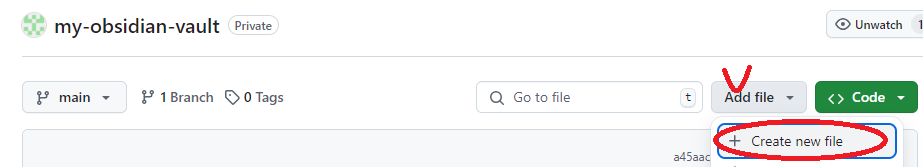
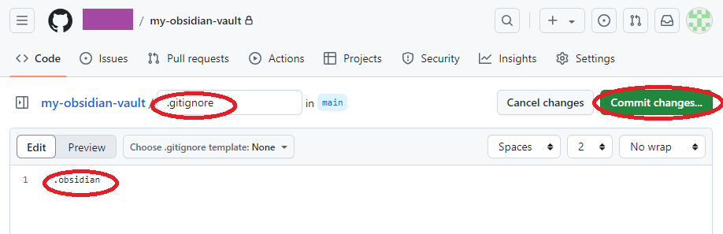
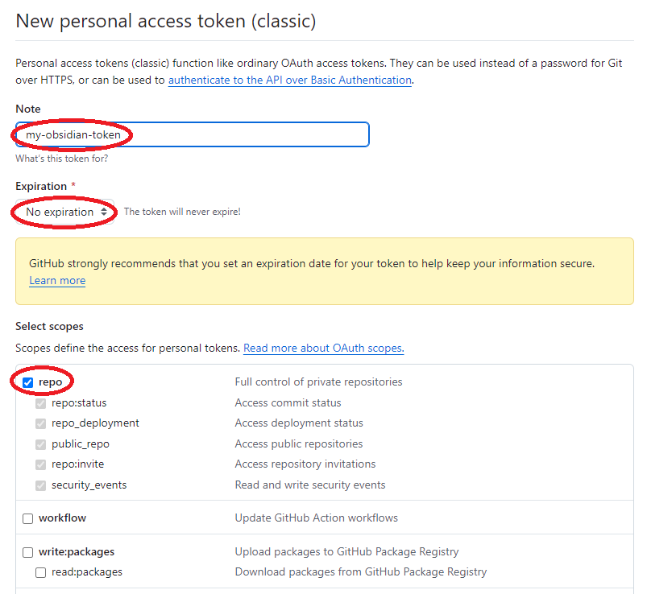
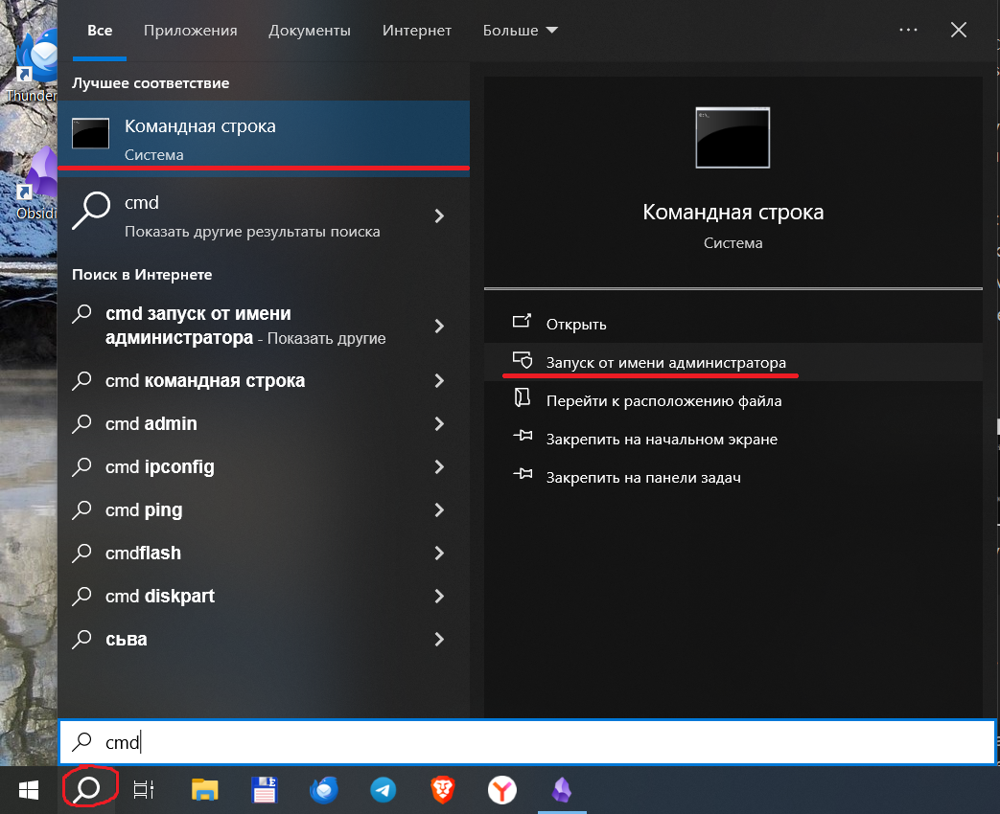
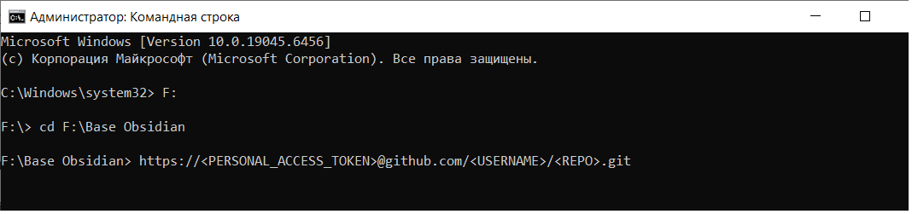
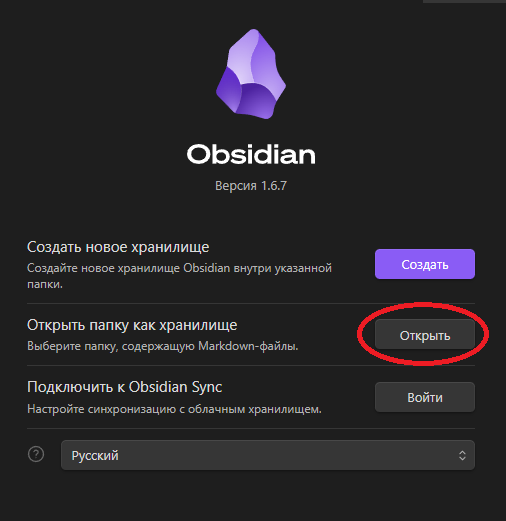
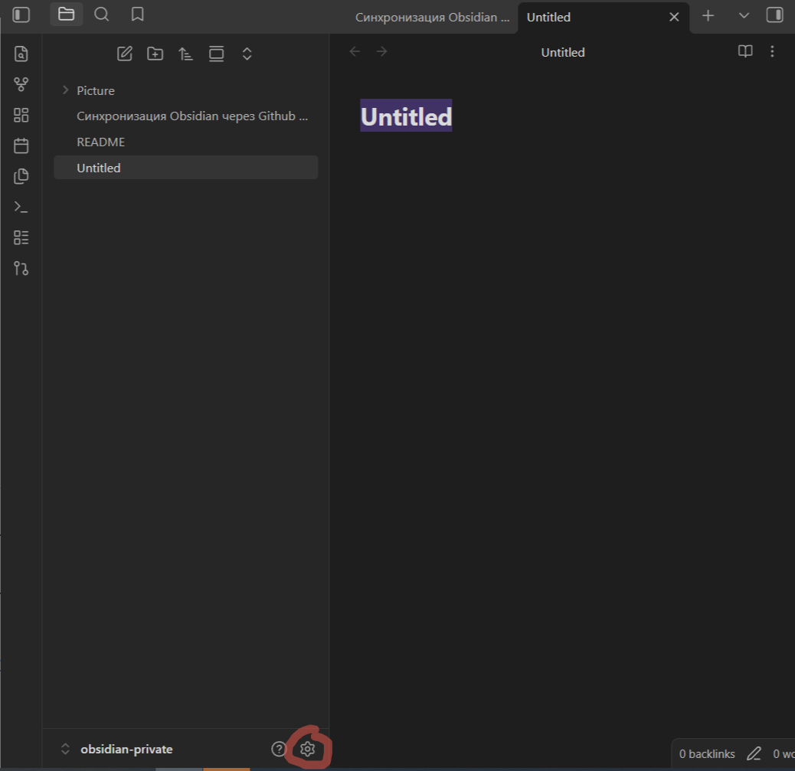
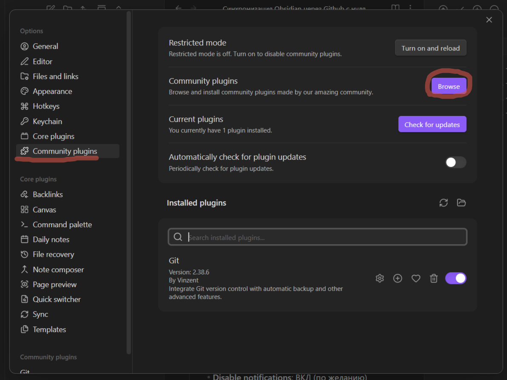
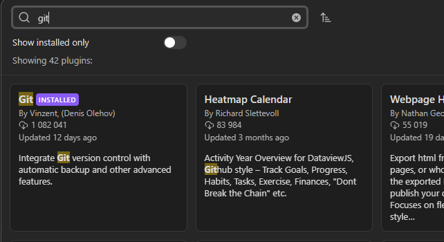
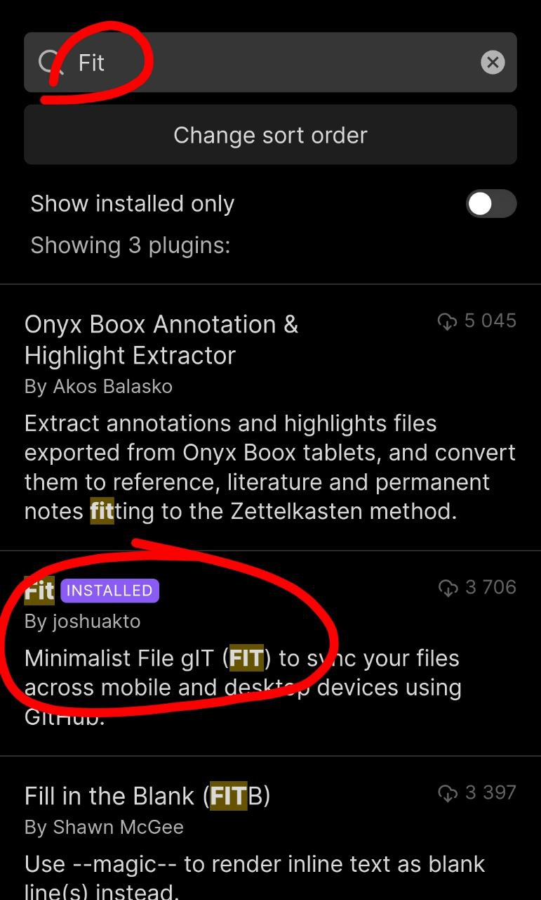

# 🔄 Синхронизация Obsidian через GitHub

Бесплатная синхронизация заметок Obsidian между компьютером и телефоном через GitHub — без Notion, iCloud и платных сервисов синхронизации.

> [!NOTE]
> **Уровень сложности:** средний (потребуется поработать с командной строкой)

## Что понадобится

- [ ] Компьютер с Windows
- [ ] Телефон (Android или iOS)
- [ ] Аккаунт на [GitHub](https://github.com/) (бесплатный)
- [ ] Установленный [Obsidian](https://obsidian.md/download)

> [!WARNING]
> **Главное правило:** никогда не редактируйте один и тот же файл одновременно на компьютере и телефоне — это приведёт к конфликту или потере данных.

## Содержание

- [Шаг 1. Создаём репозиторий на GitHub](#шаг-1-создаём-репозиторий-на-github)
- [Шаг 2. Создаём токен доступа](#шаг-2-создаём-токен-доступа)
- [Шаг 3. Настраиваем компьютер](#шаг-3-настраиваем-компьютер)
- [Шаг 4. Настраиваем телефон](#шаг-4-настраиваем-телефон)
- [Если возник конфликт](#если-возник-конфликт)
- [Частые вопросы](#частые-вопросы)

---

## Шаг 1. Создаём репозиторий на GitHub

Репозиторий — это «облачная папка» на GitHub, куда будут сохраняться ваши заметки.

1. Зарегистрируйтесь или войдите на [github.com](https://github.com/)
2. Откройте страницу [создания репозитория](https://github.com/new)
3. В поле **Repository name** введите название латиницей (например, `my-obsidian-vault`)
4. Настройте параметры:
   - **Visibility** → `Private` (рекомендуется — заметки останутся видны только вам)
   - **Add README** → включить
5. Нажмите зелёную кнопку **Create repository**

Добавьте в репозиторий ещё один файл — `.gitignore`:

6. В репозитории нажмите «добавить файл»

   

7. Назовите файл `.gitignore` и впишите внутрь одну строку:
   ```
   .obsidian
   ```

   

> [!TIP]
> **Зачем нужен `.gitignore`:** файл `.obsidian` хранит локальные настройки приложения. Если его синхронизировать, настройки с разных устройств начнут конфликтовать между собой. Без `.gitignore` вся схема просто не заработает.

---

## Шаг 2. Создаём токен доступа

Токен — это «пароль», по которому Obsidian сможет сохранять заметки в ваш репозиторий.

1. Откройте [страницу создания токена](https://github.com/settings/tokens/new)
2. Придумайте любое имя токена
3. В поле **Expiration** выберите `No Expiration`
4. Поставьте галочку **repo**
5. Внизу страницы нажмите **Generate token**

   

> [!CAUTION]
> GitHub покажет токен (вида `ghp_xxxxxxxxxxxxxxxxxxxx`) только один раз. Скопируйте его в надёжное место — если потеряете, придётся создавать новый. **Никогда не публикуйте токен и не коммитьте его в репозиторий.**

> [!IMPORTANT]
> Если не хотите давать токену доступ ко всем своим репозиториям — создайте fine-grained токен с доступом только к одному репозиторию, либо заведите отдельный GitHub-аккаунт специально под Obsidian.

---

## Шаг 3. Настраиваем компьютер

### 3.1 Устанавливаем Git

1. Скачайте и установите [Git](https://git-scm.com/downloads) — при установке ничего не меняйте, оставьте настройки по умолчанию
2. Откройте программу **Git Bash**
3. Представьтесь Git — введите команды по очереди, заменив данные на свои:
   ```bash
   git config --global user.name "Имя Фамилия"
   git config --global user.email "ваш_email"
   ```
   Проверить, что всё сохранилось, можно так:
   ```bash
   git config --global user.name
   git config --global user.email
   ```
   Команды должны показать введённые вами данные.

### 3.2 Скачиваем репозиторий на компьютер

1. Создайте на диске папку для хранилища Obsidian.

   > [!WARNING]
   > Не создавайте эту папку на рабочем столе.

2. Соберите ссылку по образцу, подставив свои данные:
   ```
   https://<ТОКЕН>@github.com/<ИМЯ_ПОЛЬЗОВАТЕЛЯ>/<НАЗВАНИЕ_РЕПОЗИТОРИЯ>.git
   ```
   Пример:
   ```
   https://ghp_xxxxxxxxxxxxxxxxxxxx@github.com/myaccount/my-obsidian-vault.git
   ```
3. Откройте командную строку через нижнюю панель (напишите в поиске CMD) и запустите от имени администратора.

   

   В появившемся окне пропишите команды для перехода в папку и клонирования репозитория.

   

   Полезные команды:
   - Перейти в подпапку → `cd ИмяПапки`
   - Перейти по полному пути → `cd C:\Полный\Путь`
   - Подняться на уровень выше → `cd ..`
   - Переключиться на другой диск → `D:`
   - Переключиться на диск и перейти в папку → `cd /d D:\Папка`

4. Выполните команду клонирования со своей ссылкой:
   ```bash
   git clone https://<ТОКЕН>@github.com/<ИМЯ_ПОЛЬЗОВАТЕЛЯ>/<НАЗВАНИЕ_РЕПОЗИТОРИЯ>.git
   ```
   Появится папка с файлами `README.md` и `.gitignore` — это и есть ваше будущее хранилище.

> [!TIP]
> Уже есть заметки в Obsidian? Сначала синхронизируйте пустой репозиторий по инструкции выше, а затем перенесите старые заметки в скачанную папку.

### 3.3 Открываем хранилище в Obsidian

1. Откройте Obsidian → **«Открыть папку как хранилище»**
2. Выберите скачанную папку

   

### 3.4 Включаем автосинхронизацию (плагин Git)

1. В Obsidian: **Настройки → Community plugins** → найдите и установите плагин **Git**

   
   
   

2. В настройках плагина включите:
   - **Vault Backup Interval (minutes)** → `1`
   - **Auto Backup after stopping file edits** → ✅ Вкл
   - **Pull updates on startup** → ✅ Вкл
   - **Disable notifications** → по желанию

> [!TIP]
> Готово! Теперь заметки автоматически сохраняются в GitHub каждую минуту, а при запуске Obsidian подтягивают актуальную версию. Синхронизировать вручную можно командой `Git: Create backup` (`Ctrl+P` → `git b`).

---

## Шаг 4. Настраиваем телефон

1. В Obsidian на телефоне создайте новое **пустое** хранилище
2. Установите community-плагин **Fit**

   

3. В настройках плагина укажите:
   - **Токен GitHub** → вставить и нажать «Authenticate user»
   - **GitHub repository name** → выбрать ваш репозиторий
   - **Branch name** → `main`
   - **Auto sync** → `Muted`
   - **Auto check interval** → 1 минута
   - **Уведомления об изменении файлов** → выключить

---

## Если возник конфликт

Возникает, если файл был изменён на двух устройствах одновременно.

- **На компьютере:** откройте файл — git пометит конфликтующие места. Отредактируйте вручную и уберите лишнее. Если правки были в разных частях файла, git часто объединяет их автоматически.
- **На телефоне:** файл не перезаписывается — «внешняя» версия сохраняется в отдельную папку `_FIT`. Сравните версии вручную и решите, что оставить.

---

## Частые вопросы

**Можно обойтись только телефоном?**
Да, шаг 3 (компьютер) можно пропустить — но тогда не будет истории изменений на ПК.

**Можно синхронизировать несколько хранилищ?**
Да, заведите под каждое свой репозиторий и повторите настройку отдельно.

**Как посмотреть историю изменений заметки?**
На сайте GitHub откройте нужный файл в репозитории и нажмите кнопку **History**.

**А если GitHub заблокирован?**
Варианты: Termux на Android, iCloud на iOS, другие open-source Git-сервисы, либо платная синхронизация от самого Obsidian.

---

## Источник и изображения

Инструкция составлена на основе идеи из статьи [Habr — Obsidian+Github вместо Notion](https://habr.com/ru/articles/843288/).

Изображения (`images/1.png` … `images/10.png`) нужно добавить в репозиторий самостоятельно — разместите их в папке `images/` рядом с этим `README.md`.
